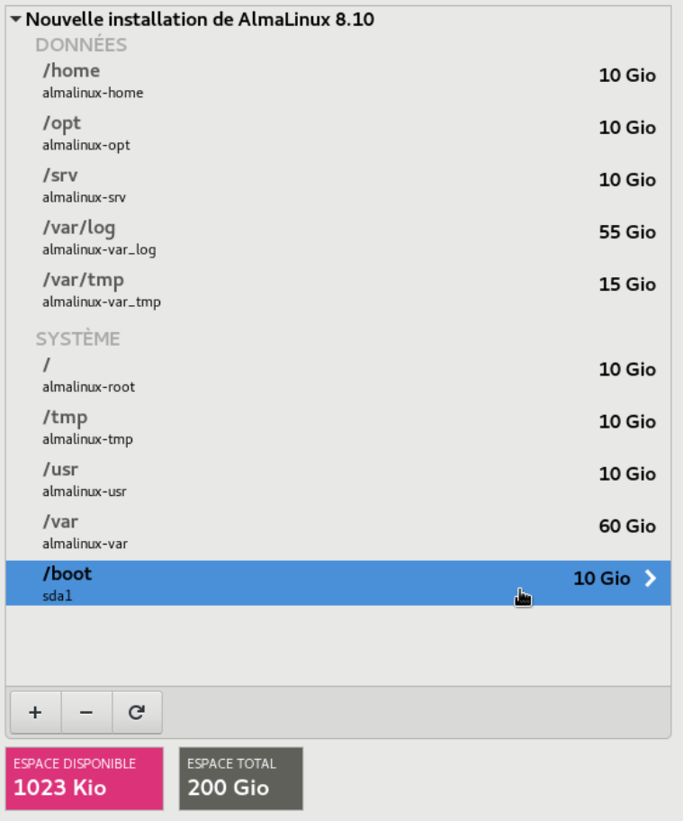
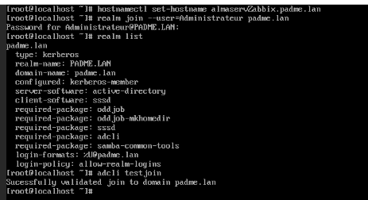

# Installation et Configuration de Zabbix sur Alma Linux 8.1

Cette documentation présente la mise en place d'une solution de supervision réseau à l'aide de Zabbix, installé sur une base Alma Linux (il est possible d'adapter la documentation à n'importe quel système d'exploitation linux).

## 1. Installation du serveur Zabbix

### Partitionnement et Sécurité
Le serveur a été déployé sur **Alma Linux 8.1**. Pour garantir la stabilité du système, le partitionnement a été réalisé en suivant les préconisations de l'**ANSSI** (isolation des partitions `/home`, `/var` et `/var/log`).

Partitionnement réalisées sur la machine : 



* **Intégration au domaine :** Le serveur a été joint au domaine Active Directory pour faciliter l'administration.



### Déploiement logiciel
L'installation s'appuie sur la documentation officiel Zabbix pour Alma Linux accesible [ici](https://www.zabbix.com/download?zabbix=7.4&os_distribution=alma_linux&os_version=10&components=server_frontend_agent&db=mysql&ws=apache).

> Note: Vous pouvez modifier les paramètres en haut de la page pour vous adapter à vos conditions (ex : version de zabbix, OS linux utilisé, ...)

---

## 2. Configuration et Connexion des Hôtes

L'accès à l'interface se fait via l'URL : `http://<IP_SERVEUR>/zabbix`.
* **Identifiants par défaut :** `Admin` / `zabbix` (modifiés immédiatement après la première connexion).

### Installation de l'Agent Zabbix sur les hôtes
Pour superviser une machine, l'agent Zabbix doit être installé et configuré pour pointer vers le serveur de supervision.

#### Sur Debian
```bash
sudo apt update
sudo apt install zabbix-agent
sudo systemctl enable zabbix-agent

```

* **Fichier `/etc/zabbix/zabbix_agentd.conf` :** Modifier `Server=<IP_ZABBIX>` et `Hostname=<NOM_HOTE>`.

#### Sur Ubuntu

```bash
wget [https://repo.zabbix.com/zabbix/7.0/ubuntu/pool/main/z/zabbix-release/zabbix-release_7.0-2+ubuntu24.04_all.deb](https://repo.zabbix.com/zabbix/7.0/ubuntu/pool/main/z/zabbix-release/zabbix-release_7.0-2+ubuntu24.04_all.deb)
dpkg -i zabbix-release_7.0-2+ubuntu24.04_all.deb
apt update
apt install zabbix-agent -y

```

* **Configuration :** Renseigner `Server`, `ServerActive` et `Hostname` dans le fichier de conf, puis redémarrer le service.

#### Sur Windows

1. Téléchargement de l'installeur `.msi` sur le site officiel.
2. Renseignement de l'IP du serveur Zabbix et du Hostname durant l'assistant d'installation.

---

## 3. Problèmes rencontrés et Résolutions

Lors de la mise en œuvre, deux obstacles majeurs ont été identifiés et résolus :

### Erreur de connexion à la base de données

* **Symptôme :** Échec de connexion entre Zabbix et MariaDB.
* **Cause :** Absence du client ou service MariaDB non initialisé.
* **Résolution :**
```bash
sudo apt update
sudo apt install mariadb-server
sudo systemctl start mariadb

```


### Blocage du pare-feu sur Ubuntu

* **Symptôme :** L'hôte apparaît "Unreachable" dans l'interface Zabbix.
* **Cause :** Le pare-feu `ufw` bloque le port 10050 utilisé par l'agent.
* **Résolution :** Ouverture du port spécifique :
```bash
sudo ufw allow 10050/tcp
sudo ufw reload

```


---

## 4. Preuves de réalisation

> *Insérer ici une capture d'écran du tableau de bord Zabbix montrant les hôtes connectés (Status "Enabled" en vert).*

```

---

### Conseils pour ton Portfolio :
* **Images :** Comme pour l'ADDS, crée un dossier `images/` dans ton GitHub et utilise la syntaxe `` pour illustrer ton travail.
* **Mise en forme :** J'ai utilisé des blocs de code (avec les trois backticks \```) pour rendre les commandes Linux plus lisibles.
* **Tableau de bord :** Le jury apprécie de voir le résultat final. Une capture d'écran de ton "Dashboard" avec plusieurs machines (Linux et Windows) est une preuve parfaite pour la compétence "Superviser le parc informatique".

Est-ce que tu veux que je t'aide à rédiger la page "Parent" (le fichier `missions_sisr.md`) pour que tes pages ADDS et Zabbix se rangent bien dessous ?

```
